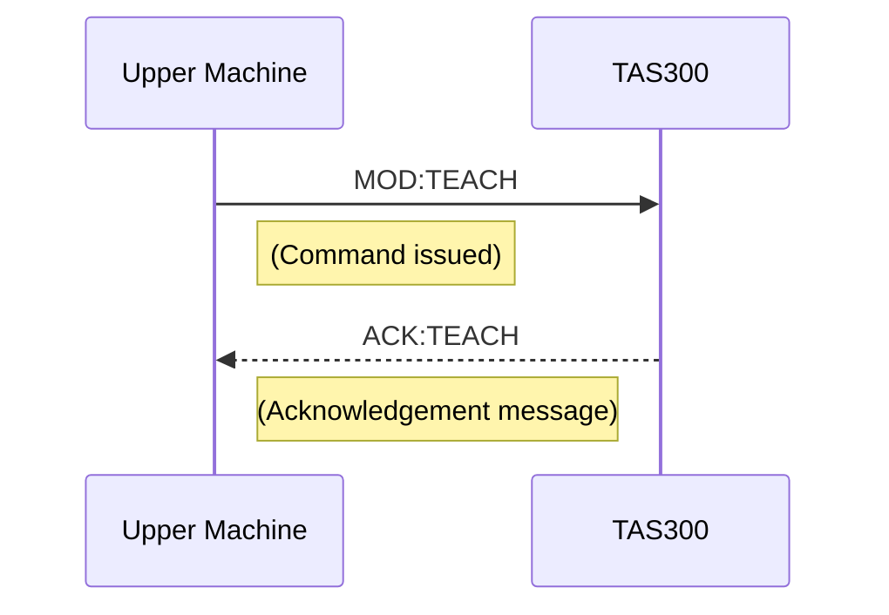
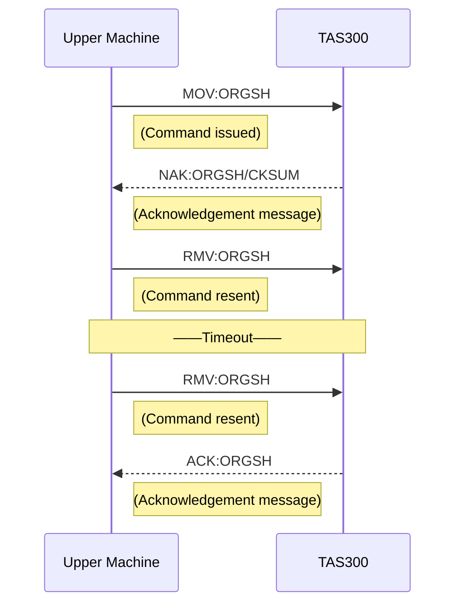
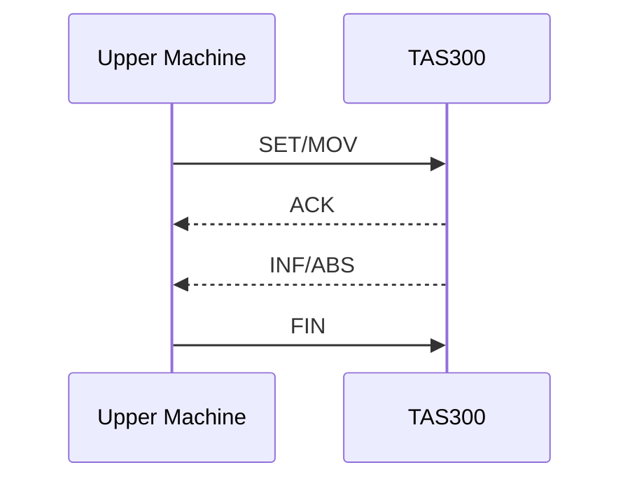
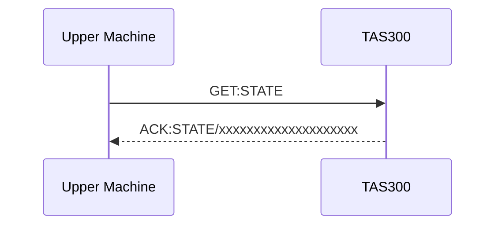

# TAS300 (E4) 介面規格整理

> 來源: E191E372 Interface Specifications (Version 4, 2006/MAY)
> 用途: 供後續 spec 程式開發使用

## 1. 通訊總覽

### 1.1 實體層 (RS-232C)
- 速率: 2400/4800/9600/19200/38400/115200 bps (預設 9600)
- 資料位元: 8
- 停止位元: 1
- 同步方式: 非同步
- 同位檢查: None
- 流量控制: None

### 1.2 連接器
- CNA2 (Dsub 9-pin male): Online 模式
- CNA3 (Dsub 9-pin male): 維護模式

CNA2/CNA3 腳位 (Dsub 9-pin):
- 2: RxD (Equipment -> TAS300)
- 3: TxD (TAS300 -> Equipment)
- 5: GND
- 其餘: NC

## 2. 通訊協定

TAS300 支援兩種通訊格式 (參數切換):
- TDK A: 標準格式 (含長度、位址、Checksum)
- TDK B: ASCII 格式 (無長度、Checksum)

### 2.1 TDK A (標準格式)
格式:

SOH | LEN | ADR | CMD | CSh | CSl | DEL

- SOH: 0x01
- LEN: 0x0004 - 0x0064 (ADR 到 CSl 的 byte 數)
- ADR: "00" - "FF"
- CMD: 命令字串
- CSh/CSl: Checksum 高/低位 (ASCII Hex)
- DEL: ETX(0x03) 或 CR(0x0D) 或 CRLF(0x0D 0x0A)
- 傳送字元間隔限制: 20ms 內

Checksum:
- 計算範圍: LEN 至 CMD 結尾
- 取加總後的低 8 位
- 轉成 2 字元 ASCII Hex

**Checksum 計算範例** (MOV:ORGSH;):
```
SOH   LEN         ADR     CMD                           CSh CSl DEL
0x01  0x00 0x0E   ０ ０   M O V : O R G S H ;           5   8   0x03

計算:
0x00 + 0x0E + 0x30 + 0x30 + 0x4D + 0x4F + 0x56 + 0x3A + 0x4F + 0x52 + 0x47 + 0x53 + 0x48 + 0x3B
= 0x358

Checksum = 0x358 & 0xFF = 0x58
CSh = '5' (0x35)
CSl = '8' (0x38)
```

### 2.2 TDK B (ASCII 格式)
格式:

SOH | ADR | CMD | DEL

- SOH: "s" (ASCII)
- ADR: "00" - "FF"
- CMD: 命令字串
- DEL: CR 或 CRLF
- 字元間無時間限制

## 3. 交握與時序 (訊號交握分析)

### 3.1 MOV/SET 類命令 (含 ACK/FIN/INF)

**注意事項:**
- 可從維護工具選擇 "No FIN command (Omission mode)" 模式
- 若系統正在等待 FIN 命令時發出 MOV 或 SET 命令，系統會回傳 NAK
  - 標準模式: /INTER
  - 擴展模式: /INTER/CBUSY
- MOV:STOP 會被接受，但之前的通訊序列會被丟棄

**時序流程:**
1. 上位機送 MOV/SET 命令 (例: `MOV:ORGSH;`)
2. TAS300 回 ACK (例: `ACK:ORGSH;`) - 操作開始
3. TAS300 執行操作中...
4. 操作結束後 TAS300 送事件:
   - 正常結束: `INF:ORGSH;`
   - 異常結束: `ABS:ORGSH/PROTS;` (含錯誤參數)
5. 上位機需送 FIN (例: `FIN:ORGSH;`)
   - Omission mode 下不需送 FIN

```mermaid
sequenceDiagram
    participant Host as Upper Machine
    participant TAS as TAS300
    Host->>TAS: MOV:ORGSH;
    Note right of Host: (Command issued)
    TAS-->>Host: ACK:ORGSH;
    Note left of TAS: (Acknowledgement message)<br/>[Operation start]
    Note over TAS: (Operating)
    TAS-->>Host: INF:ORGSH;
    Note left of TAS: [Operation end]<br/>or ABS:ORGSH/PROTS;<br/>(When there is an error)
    Host->>TAS: FIN:ORGSH;
    Note right of Host: (Command issued)<br/>[Omission mode: No command]
```

### 3.2 無需後續 FIN 的命令 (MOD, GET, EVT, TCH)

這類命令只需要 ACK 回覆，不需要 FIN 確認。

**時序流程:**
1. 上位機送命令 (例: `MOD:TEACH;`)
2. TAS300 回 ACK (例: `ACK:TEACH;`)



### 3.3 通訊錯誤重送 (RESEND)

**重送規則:**
- 收到 NAK (非 timeout 或 checksum 錯誤) 時使用 RESEND 命令
- 若不使用 RESEND，需先用 ABORT 取消後再重送
- 上位機最多重試 3 次
- 連續 3 次失敗後視為電路錯誤

**TAS300 端重試:**
- 當操作結束或有事件回報時，若 FIN 無法正常接收
- TAS300 會自動重試最多 3 次
- 重試後仍無法正常接收則中斷通訊

**時序流程 (含重送):**



### 3.4 Timeout
- FIN 模式下預設 10 秒 (可改)

## 4. 命令結構 (上位機 -> TAS300)

命令格式:
- 3 字元命令型別 + ":" + 5 字元命令名稱 + ";"
- 例: MOV:ORGSH;

### 4.1 命令型別
- SET: 初始化/指示燈設定
- MOD: 模式設定
- GET: 狀態取得
- FIN: 正常接收回覆
- MOV: 操作命令
- EVT: 事件回報控制
- TCH: 教學模式 (不建議使用)

重送型別:
- RST: SET 重送
- RFN: FIN 重送
- RMV: MOV 重送

### 4.2 SET 命令 (初始化/指示燈)
| 命令名 | 說明 |
|--------|------|
| RESET | 錯誤重置 |
| INITL | 程式初始化 (內部狀態初始化) |
| LPLOD / LON01 | LOAD 指示燈: ON |
| BLLOD / LBL01 | LOAD 指示燈: 閃爍 |
| LOLOD / LOF01 | LOAD 指示燈: OFF |
| LPULD / LON02 | UNLOAD 指示燈: ON |
| BLULD / LBL02 | UNLOAD 指示燈: 閃爍 |
| LOULD / LOF02 | UNLOAD 指示燈: OFF |
| LPMSW / LON03 | OP.ACCESS 指示燈: ON |
| BLMSW / LBL03 | OP.ACCESS 指示燈: 閃爍 |
| LOMSW / LOF03 | OP.ACCESS 指示燈: OFF |
| LPCON / LON04 | PRESENCE 指示燈: ON |
| BLCON / LBL04 | PRESENCE 指示燈: 閃爍 |
| LOCON / LOF04 | PRESENCE 指示燈: OFF |
| LPCST / LON05 | PLACEMENT 指示燈: ON |
| BLCST / LBL05 | PLACEMENT 指示燈: 閃爍 |
| LOCST / LOF05 | PLACEMENT 指示燈: OFF |
| LON07 / LBL07 / LOF07 | STATUS 1 指示燈: ON/閃爍/OFF |
| LON08 / LBL08 / LOF08 | STATUS 2 指示燈: ON/閃爍/OFF |

### 4.3 MOD 命令 (模式切換)
| 命令名 | 說明 |
|--------|------|
| ONMGV | 切換到 Online 模式 |
| MENTE | 切換到維護模式 (Offline) |
| TEACH | 切換到教學模式 (Offline，不建議使用) |

### 4.4 GET 命令 (狀態取得)
| 命令名 | 說明 |
|--------|------|
| STATE | 取得狀態 (20 字元) |
| VERSN | 取得版本 (12 字元) |
| LEDST | 取得指示燈狀態 (7 或 9 字元) |
| MAPDT | Wafer 搜尋資料 (降序，slot 25→1) |
| MAPRD | Wafer 搜尋資料 (升序，slot 1→25) |
| WFCNT | Wafer 數量 (2 字元) |

### 4.5 MOV 常用命令摘要
- ORGSH / ABORG: 原點復歸
- CLOAD / CLDDK / CLDOP / CLDYD / CLDMP / CLMPO: 載入流程
- CULOD / CULDK / CUDCL / CUDNC / CULYD / CUDMP / CUMDK / CUMFC / CULFC: 卸載流程
- MAPDO / REMAP: Mapping
- PODOP / PODCL / VACON / VACOF / DOROP / DORCL / DORBK / DORFW: 單步操作
- ZDRUP / ZDRDW / ZDRMP: Z 軸
- YWAIT / YDOOR: Y 軸
- MAPOP / MAPCL / ZMPST / ZMPED / MSTON / MSTOF: Mapper
- RETRY / STOP_ / PAUSE / ABORT / RESUM: 控制命令

### 4.6 MOV 命令完整列表

#### 組合命令 (Combined)
| 命令名 | 說明 |
|--------|------|
| ORGSH | 移動 FOUP 到初始位置 |
| ABORG | 中止操作並移動 FOUP 到初始位置 |
| CLOAD | 載入 FOUP (傳送到傳送單元) |
| CLDDK | 載入 FOUP 到準備開門位置 |
| CLDYD | 夾緊 FOUP 並移動到 Y 軸對接位置 |
| CLDOP | CLDDK 後繼續載入 FOUP |
| CLDMP | Mapping 並載入 FOUP |
| CLMPO | CLDDK 後繼續 Mapping 並載入 |
| CULOD | 卸載 FOUP (到退出位置) |
| CULDK | 關門 (同 CULOD) |
| CUDCL | CULDK 後 Undock FOUP (保持夾緊) |
| CUDNC | CULDK 後卸載 FOUP |
| CULYD | 卸載 FOUP 到對接狀態 |
| CULFC | 卸載 FOUP 到可釋放(Unclamp)狀態 |
| CUDMP | 從載入狀態 Mapping 並卸載 FOUP |
| CUMDK | 從載入狀態 Mapping 並關門 |
| CUMFC | 從載入狀態 Mapping 到 Unclamp 前狀態 |
| MAPDO | 載入時執行 Mapping |
| REMAP | 恢復中斷的 Mapping |

#### 單步命令 (Individual)
| 命令名 | 說明 |
|--------|------|
| PODOP | FOUP 夾爪: 開 |
| PODCL | FOUP 夾爪: 關 |
| VACON | 真空: ON |
| VACOF | 真空: OFF |
| DOROP | Latch Key: 開 (解鎖 FOUP 門) |
| DORCL | Latch Key: 關 (鎖住 FOUP 門) |
| MAPOP | Mapper Arm: 開 |
| MAPCL | Mapper Arm: 關 |
| ZDRUP | 移動到 Z 軸上位置 (門開位置) |
| ZDRDW | 移動到 Z 軸下位置 (傳送單元交接位置) |
| ZDRMP | 下降到 Z 軸 Mapping 結束位置並執行 Mapping |
| ZMPST | 移動 Mapper 到起始位置 |
| ZMPED | 移動 Mapper 到等待位置 |
| MSTON | Mapper Stopper: ON |
| MSTOF | Mapper Stopper: OFF |
| YWAIT | 移動到 Y 軸 Undock 位置 |
| YDOOR | 移動到 Y 軸 Dock 位置 |
| DORBK | 移動到門開位置 |
| DORFW | 移動到門關位置 |

#### 控制命令 (Control)
| 命令名 | 說明 |
|--------|------|
| RETRY | 可恢復錯誤時重試 |
| STOP_ | 立即停止並中止命令 |
| PAUSE | 立即停止 |
| ABORT | 命令中止 |
| RESUM | 恢復操作 |

### 4.7 MOV 組合命令序列對照表

**FOUP 載入操作序列:**
| 組合命令 | 序列 (單步命令順序) |
|----------|---------------------|
| CLOAD | PODCL → YDOOR → VACON → DOROP → DORBK → ZDRDW |
| CLDDK | PODCL → YDOOR → VACON → DOROP |
| CLDYD | PODCL → YDOOR |
| CLDOP | DORBK → ZDRDW |
| CLDMP | PODCL → YDOOR → VACON → DOROP → DORBK → ZMPST → MAPOP → MSTON → ZDRMP → MAPCL → MSTOF → ZDRDW |
| CLMPO | DORBK → ZMPST → MAPOP → MSTON → ZDRMP → MAPCL → MSTOF → ZDRDW |

**FOUP 卸載操作序列:**
| 組合命令 | 序列 (單步命令順序) |
|----------|---------------------|
| CULOD | ZDRUP → DORFW → DORCL → VACOF → YWAIT → PODOP |
| CULDK | ZDRUP → DORFW → DORCL → VACOF |
| CULYD | ZDRUP → DORFW → DORCL → VACOF → YWAIT |
| CULFC | ZDRUP → DORFW → DORCL → VACOF → YWAIT |
| CUDCL | YWAIT → PODOP |
| CUDNC | YWAIT → PODOP |
| CUDMP | ZDRUP → ZMPST → MAPOP → MSTON → ZDRMP → MAPCL → MSTOF → ZDRUP → ZMPED → DORFW → DORCL → VACOF → YWAIT → PODOP |
| CUMDK | ZDRUP → ZMPST → MAPOP → MSTON → ZDRMP → MAPCL → MSTOF → ZDRUP → ZMPED → DORFW → DORCL → VACOF |
| CUMFC | ZDRUP → ZMPST → MAPOP → MSTON → ZDRMP → MAPCL → MSTOF → ZDRUP → ZMPED → DORFW → DORCL → VACOF → YWAIT |

**初始化序列:**
| 組合命令 | 序列 |
|----------|------|
| ORGSH | MAPCL → ZMPED → MSTOF → DORBK → ZDRUP → DORFW → DORCL → VACOF → YWAIT → PODOP |
| ABORG | 同 ORGSH (不管門是否被吸住) |

**Mapping 操作序列:**
| 組合命令 | 序列 |
|----------|------|
| MAPDO | ZMPST → MAPOP → MSTON → ZDRMP → MAPCL → MSTOF → ZDRDW |
| REMAP | ZMPST → MAPOP → MSTON → ZDRMP → MAPCL → MSTOF → ZDRDW |

### 4.8 EVT 命令
- EVTON / EVTOF: 全事件開關
- FPEON / FPEOF: FOUP 事件開關

## 5. 回覆訊息 (TAS300 -> 上位機)

訊息格式:
- 3 字元訊息型別 + ":" + 5 字元命令名 + ("/參數") + ";"

訊息型別:
- ACK: 正常回覆 (GET 會帶參數)
- NAK: 錯誤回覆

NAK 參數:
- /CKSUM, /CMDER, /SFSER, /INTER
- 擴展模式: /INTER/CBUSY, /INTER/FPILG, /INTER/LATCH, /INTER/YPOSI, /INTER/DPOSI ...

### 5.1 NAK 參數完整列表

**標準 NAK:**
| 參數 | 說明 |
|------|------|
| /CKSUM | Checksum 錯誤 |
| /CMDER | 命令錯誤 |
| /SFSER | 保留 (未使用) |
| /INTER | Interlock 錯誤 |

**擴展 NAK (Extended Warning):**
| 參數 | 說明 |
|------|------|
| /INTER/CKSUM | Checksum 錯誤 |
| /INTER/CMDER | 命令錯誤 |
| /INTER/SFSER | 保留 (未使用) |
| /INTER/CBUSY | 通訊忙碌 (等待中)，命令不接受 |
| /INTER/FPILG | FOUP 載入錯誤或無 FOUP |
| /INTER/LATCH | Latch Key 錯誤 |
| /INTER/FPCLP | 保留 (未使用) |
| /INTER/YPOSI | Y 軸 (對接桌) 位置錯誤 |
| /INTER/DOCPO | 門開關位置錯誤 (Mapper frame 位置錯誤) |
| /INTER/DPOSI | 門開關位置錯誤 |
| /INTER/PROTS | 保留 (未使用) |
| /INTER/MPARM | Mapper Arm 收納錯誤，Mapping 起始位置錯誤 |
| /INTER/ZPOSI | Z 軸 (門上下) 位置錯誤 |
| /INTER/MPSTP | Mapper Stopper 位置錯誤 |
| /INTER/DVACM | 門正在被真空吸住 |
| /INTER/ERROR | 錯誤狀態 |
| /INTER/ORGYT | 初始化未完成 |
| /INTER/CLDDK | CLDDK 命令未完成 |
| /INTER/CULDK | CULDK 命令未完成 |
| /INTER/CLOAD | CLOAD 命令未完成 |
| /INTER/RMPOS | REMAP 未就緒 |

## 6. 事件 (TAS300 -> 上位機)

事件型別:
- INF: 正常結束/狀態變更
- ABS: 異常結束
- RIF/RAS: 事件重送

常見事件名稱:
- PODON / PODOF / SMTON / ABNST (FOUP 狀態變更)
- MANSW (面板按鍵)
- POWON (開機)
- FANST (風扇停)
- ITLON / ITLOF (Interlock)
- AIRSN (空壓異常)

ABS 參數會對應錯誤代碼 (標準或擴展模式)，需透過 GET:STATE 取得更詳細錯誤狀態。

### 6.1 ABS 錯誤代碼完整對照表

| 參數 | 說明 | 標準代碼 | 擴展代碼 | 備註 |
|------|------|----------|----------|------|
| /ZLMIT | Z 軸位置: NG (Down) | 02 | 02 | 可重試 |
| /ZLMIT | Z 軸位置: NG (Up) | 02 | 42 | 可重試 |
| /YLMIT | Y 軸位置: NG (Dock) | 04 | 04 | 可重試 |
| /YLMIT | Y 軸位置: NG (Undock) | 04 | 44 | 可重試 |
| /PROTS | Wafer 突出 | 07 | 07 | 不可重試 |
| /PROTS | Glass Wafer 突出 (選配) | 07 | 47 | 不可重試 |
| /DLMIT | 門前後位置: NG (Open) | 08 | 08 | 可重試 |
| /DLMIT | 門前後位置: NG (Close) | 08 | 48 | 可重試 |
| /MPBAR | Mapper Arm 位置: NG (Open) | 09 | 09 | 可重試 |
| /MPBAR | Mapper Arm 位置: NG (Close) | 09 | 49 | 可重試 |
| /MPZLM | Mapper Z 軸位置: NG (Down) | 10 | 10 | 可重試 |
| /MPZLM | Mapper Z 軸位置: NG (Up) | 10 | 50 | 可重試 |
| /MPSTP | Mapper Stopper 位置: NG (On) | 11 | 11 | 可重試 |
| /MPSTP | Mapper Stopper 位置: NG (Off) | 11 | 51 | 可重試 |
| /MPEDL | Mapping 結束位置: NG | 12 | 12 | 可重試 (但需從頭開始) |
| /CLOPS | FOUP 夾爪開啟錯誤 (Up) | 21 | 61 | 可重試 |
| /CLOPS | FOUP 夾爪開啟錯誤 (Back) | 21 | 21 | 可重試 |
| /CLOPS | FOUP 夾爪開啟錯誤 (Down) | 21 | 62 | 可重試 |
| /CLCLS | FOUP 夾爪關閉錯誤 (Up) | 22 | 61 | 可重試 |
| /CLCLS | FOUP 夾爪關閉錯誤 (Front) | 22 | 22 | 可重試 |
| /CLCLS | FOUP 夾爪關閉錯誤 (Middle) | 22 | 63 | 可重試 |
| /DROPS | Latch Key 開啟錯誤 | 23 | 23 | 可重試 |
| /DRCLS | Latch Key 關閉錯誤 | 24 | 24 | 可重試 |
| /VACCS | 真空 ON 錯誤 | 25 | 25 | 可重試 |
| /VACOS | 真空 OFF 錯誤 | 26 | 26 | 可重試 |
| /AIRSN | 主空氣錯誤 | 27 | 27 | 不可重試 |
| /INTOP | FOUP 開啟時正常位置錯誤 | A1 | A1 | 可重試 |
| /INTCL | FOUP 關閉時正常位置錯誤 | A2 | A2 | 可重試 |
| /INTMP | Z 軸下降時 Mapper 收納錯誤 | A3 | A3 | 保留 (未使用) |
| /INTPI | 上位機平行信號錯誤 | A4 | A4 | 可重試 |
| /SAFTY | Interlock 繼電器故障 | FD | FD | 可重試 |
| /SAFTY | 障礙偵測感測器故障 | FF | FF | 可重試 |
| - | 通訊失敗 (3 次重試後) | FE | FE | 可重試 |
| /FANST | 風扇操作錯誤 | FC | FC | 可重試 |
| /MPDOG | Mapping 機械 (調整) 錯誤 | EF | EE | 可重試 (但需從頭開始) |
| /MPDOG | Mapping 機械 (感測器) 錯誤 | EF | EF | 可重試 (但需從頭開始) |

## 7. 狀態查詢 (GET)

- VERSN: 12 字元版本字串
- LEDST: 指示燈狀態 (7 或 9 位)
- STATE: 20 位狀態字串 (模式/錯誤/位置/感測器/互鎖)
- MAPDT / MAPRD: 25 槽 wafer 資料
- WFCNT: wafer 數量

### 7.1 GET:STATE 回覆格式 (20 字元)

| 位置 | 名稱 | 值定義 |
|------|------|--------|
| (1) | 設備狀態 | 0=正常, A=可恢復錯誤, E=致命錯誤 |
| (2) | 模式 | 0=Online, 1=Teaching |
| (3) | 初始位置 | 0=未執行, 1=已執行 |
| (4) | 操作狀態 | 0=停止, 1=操作中 |
| (5) | 錯誤代碼高位 | |
| (6) | 錯誤代碼低位 | |
| (7) | FOUP 存在 | 0=無, 1=正常位置, 2=錯誤載入 |
| (8) | FOUP 夾爪狀態 | 0=開, 1=關, ?=未定義 |
| (9) | Latch Key 狀態 | 0=開, 1=關, ?=未定義 |
| (10) | 真空 | 0=OFF, 1=ON, ?=未定義 |
| (11) | 門位置 | 0=開位置, 1=關位置, ?=未定義 |
| (12) | Wafer 突出感測器 | 0=阻擋, 1=未阻擋 |
| (13) | Z 軸位置 | 0=上位置, 1=下位置, ?=未定義 |
| (14) | Y 軸位置 | 0=Undock 位置, 1=Dock 位置, ?=未定義 |
| (15) | Mapper Arm 位置 | 0=開, 1=關, ?=未定義 |
| (16) | Mapper Z 軸 | 0=收回位置, 1=Mapping 位置, ?=未定義 |
| (17) | Mapper Stopper | 0=ON, 1=OFF, ?=未定義 |
| (18) | Mapping 狀態 | 0=未執行, 1=正常結束, 2=異常結束 |
| (19) | Interlock Key | 0=啟用, 1~3=停用 |
| (20) | Info Pad | 0=無輸入, 1=A-pin ON, 2=B-pin ON, 3=A-pin/B-pin ON |

### 7.2 GET:LEDST 回覆格式

**7 字元格式:**
| 位置 | 名稱 | 值: 0=Off, 1=On, 2=Flash |
|------|------|--------------------------|
| (1) | PRESENCE | |
| (2) | PLACEMENT | |
| (3) | LOAD | |
| (4) | UNLOAD | |
| (5) | Op.ACCESS | |
| (6) | Reserved 1 | |
| (7) | Reserved 2 | |

**9 字元格式 (STATUS1/2 非內部控制時):**
| 位置 | 名稱 |
|------|------|
| (1)-(7) | Indicator 1-7 |
| (8) | Indicator 8 |
| (9) | Table Indicator 1 |

### 7.3 GET:MAPDT / MAPRD 回覆格式

25 字元，每字元代表一個 slot:
- `0`: 無 Wafer
- `1`: 有 Wafer
- `2`: 交叉 (Crossed)
- `?`: 未定義
- `W`: 重疊 Wafer (選配)

MAPDT: slot 25 → slot 1 (降序)
MAPRD: slot 1 → slot 25 (升序)

### 7.4 GET:WFCNT 回覆格式
2 字元 ASCII 數字，若未定義則為 `??`

### 7.5 GET:VERSN 回覆格式
12 字元版本字串 (空白以空格填充)

## 8. 外部介面 (硬體)

E3 版本外部介面摘要:
- CNA1: DC24V
- CNA2: 上位機 RS-232C
- CNA3: 維護 RS-232C
- CNA4: Parallel I/O
- CNA5: 操作面板 I/O
- CNA6: Carrier ID reader
- CNA7: AMHS interlock relay

## 9. 互鎖 (Interlock)

### 9.1 軟體互鎖摘要
- 障礙偵測、FOUP 未正常定位、門未關、夾爪狀態錯誤等均會互鎖
- PAUSE 狀態下不接受命令
- 互鎖條件依 MOV 指令不同有差異 (詳見完整互鎖表)

### 9.2 互鎖條件完整表格

#### 組合命令互鎖 (操作前 NAK / 操作中 ABS)

| 命令 | 操作前互鎖 (NAK) | 操作中互鎖 (ABS) |
|------|------------------|------------------|
| ORGSH | /ERROR, /CBUSY, /DVACM (0-return 不需), /FPILG (除無 FOUP 且門關外) | /SAFTY, /AIRSN, /FANST |
| ABORG | /ERROR, /CBUSY | /SAFTY, /AIRSN, /FANST |
| CLOAD | /ERROR, /CBUSY, /ORGYT, /FPILG, /LATCH, /DPOSI | /SAFTY, /AIRSN, /FANST, /INTOP, /DRCLS, /PROTS |
| CLDDK | /ERROR, /CBUSY, /ORGYT, /FPILG, /LATCH, /DPOSI | /SAFTY, /AIRSN, /FANST, /INTOP, /DRCLS |
| CLDOP | /ERROR, /CBUSY, /ORGYT, /FPILG, /CLDDK (未完成) | /SAFTY, /AIRSN, /FANST, /INTOP, /PROTS |
| CLDMP | /ERROR, /CBUSY, /ORGYT, /FPILG, /LATCH, /DPOSI, /ZPOSI | /SAFTY, /AIRSN, /FANST, /INTOP, /PROTS, /MPEDL |
| CLMPO | /ERROR, /CBUSY, /ORGYT, /FPILG, /CLDDK, /ZPOSI | /SAFTY, /AIRSN, /FANST, /INTOP, /PROTS, /MPEDL |
| CULOD | /ERROR, /CBUSY, /ORGYT, /FPILG, /YPOSI, /LATCH | /SAFTY, /AIRSN, /FANST, /INTCL, /PROTS, /VACCS, /YLMIT |
| CULDK | /ERROR, /CBUSY, /ORGYT, /FPILG, /YPOSI, /LATCH | /SAFTY, /AIRSN, /FANST, /INTCL, /PROTS, /VACCS, /YLMIT |
| CULYD | /ERROR, /CBUSY, /ORGYT, /FPILG, /YPOSI, /LATCH | /SAFTY, /AIRSN, /FANST, /INTCL, /PROTS, /VACCS, /YLMIT |
| CUDCL | /ERROR, /CBUSY, /ORGYT, /FPILG, /YPOSI, /LATCH, /CULDK | /SAFTY, /AIRSN, /FANST, /INTCL |
| CUDNC | /ERROR, /CBUSY, /ORGYT, /FPILG, /YPOSI, /LATCH, /CULDK | /SAFTY, /AIRSN, /FANST, /INTCL |
| CULFC | /ERROR, /CBUSY, /ORGYT, /FPILG, /YPOSI, /LATCH | /SAFTY, /AIRSN, /FANST, /INTCL, /PROTS, /VACCS, /YLMIT |
| MAPDO | /ERROR, /CBUSY, /ORGYT, /CLOAD | /SAFTY, /AIRSN, /FANST, /INTOP, /PROTS, /MPEDL |
| REMAP | /ERROR, /CBUSY, /ORGYT, /RMPOS | /SAFTY, /AIRSN, /FANST, /INTOP, /PROTS, /MPEDL |
| CUDMP | /ERROR, /CBUSY, /ORGYT, /FPILG, /YPOSI, /LATCH, /DPOSI, /MPARM | /SAFTY, /AIRSN, /FANST, /INTCL, /DLMIT, /PROTS, /VACCS, /YLMIT |
| CUMDK | /ERROR, /CBUSY, /ORGYT, /FPILG, /YPOSI, /LATCH, /DPOSI, /MPARM | /SAFTY, /AIRSN, /FANST, /INTCL, /DLMIT, /PROTS, /VACCS, /YLMIT |
| CUMFC | /ERROR, /CBUSY, /ORGYT, /FPILG, /YPOSI, /LATCH, /DPOSI, /MPARM | /SAFTY, /AIRSN, /FANST, /INTCL, /DLMIT, /PROTS, /VACCS, /YLMIT |

#### 單步命令互鎖

| 命令 | Timeout | 操作前互鎖 (NAK) | 操作中互鎖 (ABS) |
|------|---------|------------------|------------------|
| PODOP | 3s | /ERROR, /CBUSY, /DPOSI (門開時) | /SAFTY, /AIRSN, /FANST |
| PODCL | 3s | /ERROR, /CBUSY, /FPILG | /SAFTY, /AIRSN, /FANST, /CLCLS |
| VACON | 5s | /ERROR, /CBUSY | /SAFTY, /AIRSN, /FANST |
| VACOF | 5s | /ERROR, /CBUSY | /SAFTY, /AIRSN, /FANST |
| DOROP | 3s | /ERROR, /CBUSY | /SAFTY, /AIRSN, /FANST |
| DORCL | 3s | /ERROR, /CBUSY, /DPOSI (門開且吸住時) | /SAFTY, /AIRSN, /FANST |
| ZDRUP | 30s | /ERROR, /CBUSY, /DPOSI, /FPILG, /MPARM, /MPSTP | /SAFTY, /AIRSN, /FANST, /DLMIT, /PROTS |
| ZDRMP | 30s | /ERROR, /CBUSY, /DPOSI, /MPARM, /ZPOSI | /SAFTY, /AIRSN, /FANST, /PROTS |
| ZDRDW | 30s | /ERROR, /CBUSY, /DPOSI, /MPSTP, /MPARM | /SAFTY, /AIRSN, /FANST, /DLMIT, /PROTS |
| YWAIT | 10s | /ERROR, /CBUSY, /DVACM, /LATCH | /SAFTY, /AIRSN, /FANST |
| YDOOR | 10s | /ERROR, /CBUSY, /FPILG, /LATCH | /SAFTY, /AIRSN, /FANST |
| DORBK | 10s | /ERROR, /CBUSY, /LATCH | /SAFTY, /AIRSN, /FANST |
| DORFW | 10s | /ERROR, /CBUSY, /FPILG, /LATCH, /DPOSI | /SAFTY, /AIRSN, /FANST |
| MAPOP | 10s | /ERROR, /CBUSY, /DPOSI, /MPARM | /SAFTY, /AIRSN, /FANST, /MPBAR |
| MAPCL | 10s | /ERROR, /CBUSY | /SAFTY, /AIRSN, /FANST, /PROTS |
| ZMPST | 10s | /ERROR, /CBUSY, /DPOSI, /MPARM | /SAFTY, /AIRSN, /FANST, /PROTS |
| ZMPED | 10s | /ERROR, /CBUSY, /DPOSI, /MPARM | /SAFTY, /AIRSN, /FANST, /PROTS |
| MSTON | 10s | /ERROR, /CBUSY, /ZPOSI | /SAFTY, /AIRSN, /FANST |
| MSTOF | 10s | /ERROR, /CBUSY | /SAFTY, /AIRSN, /FANST |

### 9.3 互鎖強制解除
- 維護模式下可用鑰匙開關解除
- 作業中不可留置鑰匙

## 10. 程式開發重點 (實作注意)

- TDK A 協定需要 LEN + Checksum，且字元間隔 <= 20ms
- FIN 確認模式下，必須在 INF/ABS 後回 FIN
- NAK 回覆若非 timeout/CKSUM，需用 RESEND
- MOV/SET 需配合 ACK + INF/ABS + FIN 的完整交握
- 狀態與錯誤需以 GET:STATE 再確認 (尤其 ABS)
- 事件回報需先用 EVT 命令啟用
- 互鎖條件會阻止命令執行，需對應 NAK/ABS 做保護

## 11. 交握圖示補充 (命令->回覆->事件)





## 12. 參數設定 (Appendix A)

### 12.1 Event 參數
| 名稱 | 說明 | 選項 |
|------|------|------|
| FOUP event report | FOUP 狀態變更回報 | [Report]*, [No report], [Extend] |
| FOUP event monitoring frequency | FOUP 狀態監控頻率 | [2-50] (10ms 單位), 預設[2] |
| Power ON event report | 開機就緒回報 | [No report]*, [Report] |
| FAN-stopped event report | 風扇停止回報 | [No report]*, [Report] |
| NAK report setting | NAK 擴展回報 | [Normal]*, [Extended report] |
| Interlock override key event report | Interlock 解除回報 | [No report]*, [Report] |
| Event report control setting | 事件產生控制 | [Enabled], [Disabled]* |
| Get status setting | GET:STATE 回覆擴展 | [Normal]*, [Extend] |
| Air-down event report | 空壓狀態變更回報 | [No report], [Report]*, [Extend] |
| Wafer protrusion sensor event report | Wafer 突出感測器回報 | [No report]*, [Report] |
| Interlock (Ok To Operate) event report | Interlock 信號回報 | [No report]*, [Report] |
| Interlock (TAS Valuable) event report | TAS Valuable 信號回報 | [No report]*, [Report] |
| Low voltage event report | 低電壓回報 | [No report]*, [Report] |

### 12.2 Communication 參數
| 名稱 | 說明 | 選項 |
|------|------|------|
| Baud rate | CNA2 鮑率 | [2400, 4800, 9600*, 19200, 38400, 115200] |
| Delimiter | CNA2 結束符 | [ETX]*, [CRLF], [CR] |
| Machine address | Load Port 位址 | [0-255], 預設[0] |
| Communication timeout | FIN 接收 Timeout | [1-99]sec, 預設[10] |
| FIN confirmation mode | FIN 確認模式 | [Confirm]*, [Don't Confirm] |
| Protocol | CNA2 協定 | [TDK A]*, [TDK B], [User], [User2] |
| INF delay time | INF/ABS 發送延遲 | [0-500]msec, 預設[0] |
| Teaching mode | 教學模式 | [Enable], [Disable]* |
| Error code mode | 錯誤代碼模式 | [Standard]*, [Extended] |
| Origin return request | 原點復歸需求 | [Yes]*, [No] |
| Communication topology | 通訊拓撲 | [1:1]*, [1:N] |

### 12.3 Cylinder 參數
| 名稱 | 說明 | 選項 |
|------|------|------|
| Cylinder timeout | 氣缸 Timeout | [1-99]sec |
| Retry count | 重試次數 | [0-99], 預設[0] |

### 12.4 Mapper 參數
| 名稱 | 說明 | 選項 |
|------|------|------|
| Cylinder timeout | 氣缸 Timeout | [1-99]sec |
| Mapping data mode | 無效結果回傳值 | [0]*, [?] |
| Double wafer detection | 雙片偵測 (選配) | [Enable], [Disable]* |
| Adjustment level | 雙片偵測閾值偏移 | [0-99], 預設[40] |

### 12.5 I/O 參數
| 名稱 | 說明 | 選項 |
|------|------|------|
| Upper machine signal monitoring | PI/O 停止控制 | [Monitor]*, [Not monitor] |
| FAN | 氣流控制風扇 | [Enable], [Disable]* |
| Glass wafer protrusion sensor | Glass Wafer 突出感測器 | [Enable], [Disable]* |
| Carrier indicator mode | Carrier 指示燈模式 | [Normal]*, [Independence] |

### 12.6 Indicators 參數
| 名稱 | 說明 | 選項 |
|------|------|------|
| Indicator configuration mode | 指示燈配置模式 | [Number with Function]*, [Only Function] |
| Upper indicators (1-8) | 上方指示燈功能 | NO, AL, ST1-ST2, PR, PL, PI1-PI5, CMD1-CMD16 |
| Table indicators (1-2) | 桌面指示燈功能 | 同上 |

### 12.7 Switches 參數
| 名稱 | 說明 | 選項 |
|------|------|------|
| Table switches (1-2) | 桌面開關功能 | NO, PO1-PO4, ON, BT, TG, TS |

**指示燈功能說明:**
- NO: 無功能
- AL: 警報顯示 (內部控制)
- ST1-ST2: 狀態顯示 (內部控制)
- PR: Presence 顯示 (內部控制)
- PL: Placement 顯示 (內部控制)
- PI1-PI5: 從 PIO (CNA4) 控制
- CMD1-CMD16: 從通訊命令控制

**開關功能說明:**
- NO: 無功能
- PO1-PO4: 輸出到 PIO (CNA5)
- ON: 按下時回報通訊事件
- BT: 按下並放開時回報通訊事件
- TG: 每次按下切換 ON/OFF 狀態
- TS: 按住時點亮所有指示燈
